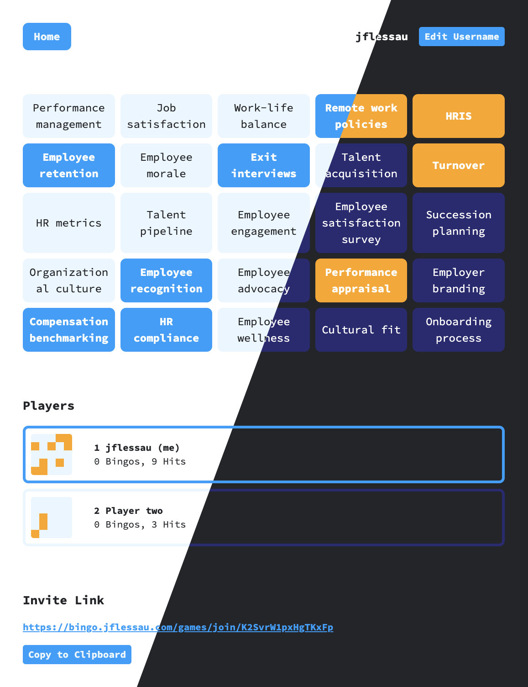

# bs-bingo

Realtime multiplayer bullshit bingo for the web.

Stack: [Rust](https://www.rust-lang.org/), [Postgres](https://www.postgresql.org/), [Svelte](https://svelte.dev/).

[Demo](https://bingo.jflessau.com)

## Development

Prepare the `.env` file, spin up a postgres database and use [sqlx](https://crates.io/crates/sqlx-cli) to run the migrations:

```bash
cp api/.example-env api/.env
docker-compose up
cargo install sqlx-cli
sqlx migrate run
```

Start the frontend dev server with `npm i && npm run dev` and run the API service with `cargo run`.

Happy hacking :)

## Screenshot


